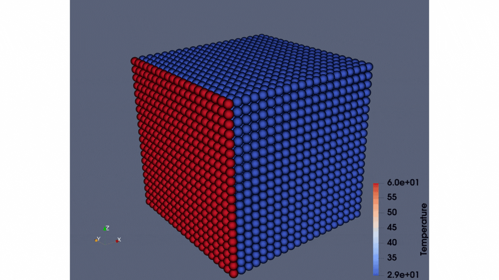

# SPH_thermal_CPU: Part 1
## Description

This project implements a CPU-based Smoothed Particle Hydrodynamics (SPH) thermal simulation.



## Building the project

1. Clone the repository:
```
git clone https://github.com/AhmedElbossily/SPH_thermal_CPU.git
```

2. Open the terminal and navigate to the `SPH_thermal_CPU` directory:
```
cd SPH_thermal_CPU
```

3. Create a `build` directory:
```
mkdir build
```

4. Change to the `build` directory:
```
cd build
```

5. Build the project:
```
cmake ..
```

6. Compile the project:
```
make
```

## Usage

To run the simulation, execute the following command:

```
./SPH_thermal_CPU
```

## Expected outputs 

- You can monitor the percentage of completion on the terminal.
- The output files will be saved in the `results` folder inside the project directory.

## Authors

- Ahmed Elbossily (`ahmed.fathy.elbossily@gmail.com`)

## Acknowledgements

This project makes use of the excellent [iwf_mfree_gpu_3d](https://github.com/iwf-inspire/iwf_mfree_gpu_3d) open-source project developed at [ETHZ](https://ethz.ch/en.html) by:

We are grateful for their contributions and the availability of their work, which has significantly aided the development of this software.

## Feedback

If you have any feedback, please reach out to us at `ahmed.fathy.elbossily@gmail.com`

## License

[GNU](http://www.gnu.org/licenses/)

